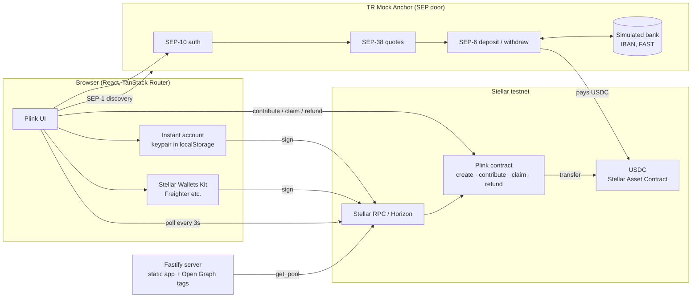

# Plink

**Create a payment link in a blink.**

Plink is link-first group funding on Stellar. Someone creates a link for a goal with a target
("Weekend house in Şile, $120 by Sunday"), pastes it into the group chat, and
everyone chips in, by Turkish bank transfer or with crypto. The money sits in a
Soroban smart contract, not with the organizer. If the target is reached before
the deadline, the organizer claims it (and can cash out to their IBAN). If not,
every contributor takes their own money back.

Built at the Stellar Pro Hackathon 2026 (Istanbul, Genesis track). Live on
**Stellar testnet** with real on-chain contributions, claims and refunds.

- Live app: https://stellar-hackathon-grand-pera.osmn.cc/
- Product cheat sheet: https://claude.ai/artifact/HtTkMattk7Dz5BX7aYwYr8
- Contract: [`CDTYAFC6LL2DSZYOIPRLXN2TU4OJ6B7TMZCKVDTJATUAJZMKWTNE564L`](https://stellar.expert/explorer/testnet/contract/CDTYAFC6LL2DSZYOIPRLXN2TU4OJ6B7TMZCKVDTJATUAJZMKWTNE564L) (see [deployments/testnet.json](deployments/testnet.json))
- Fiat rail: [TR Mock Anchor](https://tr-mock-anchor.fly.dev/) (TRY ⇄ USDC, SEP-1/10/12/38/6, testnet sandbox)

## Why

Today a group collection means one person shares their IBAN, holds everyone's
money, tracks who paid and refunds by hand if the plan falls through. Plink
makes it as easy as a WhatsApp poll, and the rules are enforced by a contract
instead of trust in the organizer.

Target users: friends planning trips, school clubs, Discord communities,
creators collecting support. Same product, different audiences; the audience
already exists somewhere else, Plink only supplies the link.

## How it works



### The pieces

| Component | Where | Responsibility |
|---|---|---|
| Soroban contract | [`contracts/plink`](contracts/plink/src/lib.rs) | Holds USDC per pool. Enforces the one funding rule. Emits typed events. |
| Frontend | [`frontend/`](frontend/) | Create link, pool page with live progress, contribute sheet (bank or crypto), claim + cash-out, refund, demo panel. |
| Anchor client | [`frontend/src/lib/anchor.ts`](frontend/src/lib/anchor.ts) | SEP-1 discovery, SEP-10 challenge signing, SEP-38 price, SEP-6 deposit/withdraw, status polling. |
| Instant account | [`frontend/src/lib/wallet.ts`](frontend/src/lib/wallet.ts) | A per-browser Stellar keypair, friendbot-funded, USDC trustline opened on first use. Nobody installs anything. External wallets via Stellar Wallets Kit. |
| Server | [`server/`](server/) | Serves the built app; injects per-link Open Graph tags (title, progress) read from the contract so the WhatsApp preview is meaningful. No database: all state is on-chain. |
| Seed script | [`frontend/scripts/seed.mts`](frontend/scripts/seed.mts) | Stages the demo pools on testnet using real anchor deposits for the persona accounts. |

### The funding rule (contract)

One rule, no options: **reach the target before the deadline to unlock funds
for the organizer; otherwise contributors can refund after the deadline.**

- `create(creator, organizer, title, target, deadline, emoji, vibe) → id`
- `contribute(id, from, amount, name, method)`: `from.require_auth()`, only
  while `now ≤ deadline` and not claimed. Moves USDC from the contributor into
  the contract. A repeat contribution adds to the same record.
- `claim(id)`: creator auth, only when `raised ≥ target`, once. Pays the whole
  pool to the creator. Allowed after the deadline too, because the target was hit.
- `refund(id, contributor)`: contributor auth, only when `now > deadline` and
  `raised < target`. Returns exactly what that address put in.
- Reads: `get_pool`, `get_contribution`, `get_contributions`, `list_pools`, `count`.
- `debug_set_deadline(id, ts)`: **admin-only demo helper** used by the seed
  script to stage an "expired" pool without waiting. Documented here so it is
  not mistaken for product behaviour; it is removed before any mainnet deploy.

Storage: pool and contribution records in persistent storage (TTL bumped on
every write), admin/token/counter in instance storage. Contributor list per pool
is a bounded `Vec<Address>` (200) so `get_contributions` stays cheap to simulate.

Amounts are `i128` USDC base units (7 decimals). The token is the Circle testnet
USDC Stellar Asset Contract, so the contract talks SEP-41 and the anchor's
classic USDC payments land in the same balance the contract moves.

### Payment paths

**Bank transfer (TRY)**, the path the hackathon cares about most:

1. Plink makes sure the contributor's account exists and trusts USDC.
2. SEP-1: read `stellar.toml` from `tr-mock-anchor.fly.dev`.
3. SEP-10: fetch a challenge, sign it with the contributor's key, get a JWT.
4. SEP-38: price TRY→USDC; the sheet shows the ₺ amount for the chosen $.
5. SEP-6 `deposit`: the anchor returns IBAN + reference. Plink shows them as a
   bank transfer card, clearly labelled *simulated bank*.
6. "I sent the transfer" calls the sandbox's `simulate-bank-transfer` (in real
   life the user pays from their banking app and this step is the bank).
7. The deposit is now a **pending contribution**, saved in the browser. Plink
   polls SEP-6 `/transaction` until `completed`; real testnet USDC lands in the
   contributor's account. The sheet can be closed; the pool page keeps
   finishing it, even after a reload. Real bank transfers take time, and so
   does the sandbox sometimes.
8. Plink invokes `contribute` on the contract. The progress bar moves for
   everyone watching the link.

The anchor accepts at most ₺3000 per transfer, so the sheet caps a single bank
contribution at that (about $60) and suggests splitting or paying the rest in
USDC.

**Crypto (USDC)**: the instant account or a connected wallet (Stellar Wallets
Kit) signs `contribute` directly. Both routes fund the same pool.

**Claim + cash-out**: `claim` moves USDC to the organizer's account. "Cash out
to IBAN" then runs SEP-6 `withdraw`, pays the anchor's treasury with the memo
it returned, and polls until the anchor reports the (simulated) FAST payout as
completed. The UI distinguishes *initiated* from *completed*.

**Refund**: on an ended, underfunded pool each contributor sees a
"Get my $X back" button that calls `refund`.

What is simulated: the bank leg, KYC (SEP-12 auto-approves), and the TRY payout.
What is real: every Stellar transaction (USDC payments, contract calls), the
SEP protocol exchange with the anchor, and the funding rule.

## Run it

Prerequisites: Node 22+, pnpm, Rust with `wasm32v1-none`, `stellar` CLI 28,
`just`, Docker (for the container build).

```bash
just install          # pnpm workspace install
just test             # contract unit tests
just dev              # frontend on http://localhost:10013
```

The app targets the deployed testnet contract in `deployments/testnet.json`;
nothing local to run besides the frontend. For a fresh contract:

```bash
stellar keys generate plink-deployer --network testnet --fund
just deploy-contract  # prints the new contract id
# put it in deployments/testnet.json, then
just bindings
```

Production build and container (what the VPS runs behind Caddy):

```bash
cp .env.example .env  # PUBLIC_URL, PLINK_PORT, optional DEMO_TREASURY_SECRET
just up               # docker compose up -d --build
```

Caddy in front of it:

```caddyfile
stellar-hackathon-grand-pera.osmn.cc {
    reverse_proxy 127.0.0.1:10013
}
```

`PUBLIC_URL` is baked into the frontend at build time (share links) and read by
the server at runtime (Open Graph tags), so rebuild after changing it.

## Demo

Story: friends funding a weekend house. Prep (once, ~2 minutes):

```bash
just seed
```

This creates two pools on testnet with real anchor deposits from persona
accounts and prints their links:

- **Weekend house in Şile**: $120 target, $90 in (Ayşe by bank, Mert in USDC),
  **$30 to go**.
- **Class trip to Ankara**: $500 target, $40 in, deadline already passed →
  refund demo.

Pass `--creator-secret S…` (your browser's instant account secret, revealed in
the demo panel) to make *you* the organizer of the seeded pools, so the claim
happens in your own browser. Pass `--treasury-secret S…` (any account holding
USDC, e.g. after a claim or `just fund plink-deployer 200`) to fund the
personas directly instead of waiting on the anchor's payout queue.

Run of show (2–3 minutes):

1. **Create.** Home page: goal, target, deadline, pick a colour. "Create link".
   The link card appears; copy or WhatsApp it.
2. **Two contributors.** Open the seeded house link in two isolated browser
   profiles (or `localhost` vs `127.0.0.1`, which keep separate instant
   accounts). One chips in by **bank transfer** (IBAN card → "I sent the
   transfer" → USDC lands → bar moves). The other chips in **USDC**. Target
   reached: confetti, sticker, "Target reached".
3. **Claim.** The organizer opens the link, sees "You're the organizer", claims,
   optionally cashes out to IBAN through the anchor.
4. **Refund.** Open the expired trip link as Zeynep (demo panel → paste her
   secret from `frontend/scripts/.seed-state.json`) and take the $40 back.

If the anchor is slow, `just expire <poolId> zeynep` stages the refund pool
from USDC a persona already holds, without any anchor deposit.

Demo panel at `/demo`: current account + balances, "Get $N via anchor" (runs
the deposit flow), an instant top-up from the server's demo treasury when
`DEMO_TREASURY_SECRET` is configured, switch to any testnet secret, list of all
pools.

Timing note: the mock anchor usually pays out USDC within seconds, sometimes
takes a minute or two, and under load its payout queue has stalled for longer.
Pending bank contributions survive that: close the sheet, keep presenting, the
bar moves when the money lands. Check the anchor before going on stage:
`just persona ayse` prints her anchor transactions and balances.

## Design

Airbuds-inspired: monochrome base, one vibrant accent per pool chosen at
creation, wide bold display type (Unbounded), pill badges, tilted stickers,
spring motion, and a deliberately loud target-reached moment. Mobile-first,
everyday language; wallet words only appear on the crypto path.

## Design decisions and trade-offs

- **USDC as the one settlement asset.** The anchor ramps TRY ⇄ USDC, so the
  pool holds USDC and the target is in dollars with a ₺ hint. Crypto contributors
  pay USDC directly; no swaps in the critical path.
- **Instant accounts instead of mandatory wallets.** A fiat contributor should
  never see the word wallet. The keypair lives in the browser (testnet,
  friendbot-funded). On mainnet this slot is an embedded wallet provider;
  Stellar Wallets Kit is already wired for people who have one.
- **No database.** Pool state and contributor lists are read from the contract.
  The server only exists for Open Graph previews and static hosting.
- **Polling, not streaming.** The pool page re-simulates `get_pool` and
  `get_contributions` every 3 s. Simple, good enough for a group chat's scale.
- **Contributor names on-chain.** A 32-char name and a `bank|crypto` tag are
  stored with each contribution so the list feels human without a backend.
- **Hackathon shortcuts, labelled.** `debug_set_deadline` and the demo panel
  exist to make the refund path demoable; both are called out in code and here.

## Challenges

- **Tailwind v4 theme variables**: per-pool accents needed `@theme inline` so
  utilities reference the CSS variable at use-site rather than resolving it at
  `:root`.
- **Anchor latency**: the sandbox pays USDC asynchronously; the deposit flow
  polls with a generous timeout and surfaces the anchor's own status strings.
- **Rounding**: the ₺ amount is rounded up by one kuruş so the delivered USDC is
  never a hair short of the contribution the user chose; the contract call uses
  `min(chosen, balance)`.

## Stellar skills used

- `.claude/skills/smart-contracts/SKILL.md` (+ `development.md`) for contract
  anatomy, storage/TTL, token transfers and events.
- `.claude/skills/dapp/SKILL.md` for `contract.Client`, Wallets Kit v2 API and
  SEP-10 signing from the browser.
- `.claude/skills/stellar-anchor-skill/SKILL.md` and
  `.claude/skills/standards/SKILL.md` for the SEP-1/10/6/38 sequence and its
  failure modes (`pending_trust`, memo handling on withdraw).

## Roadmap

- Embedded wallet provider (passkeys) in place of the localStorage keypair.
- Real TRY anchor on mainnet: same code, new home domain and network passphrase.
- Success fee on funded pools as the business model.
- Contributor messages and a shareable target-reached card.
- Next step: SCF application with the mainnet anchor integration.
